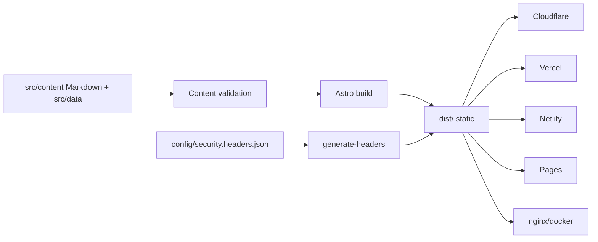

# Krish Parajuli — Static Portfolio

Static Astro + TypeScript portfolio. Build locally and serve the resulting
`dist/` on any static web server. No hosting account, GitHub account, server
runtime, database or vendor SDK is required by the website.

**Hosting integrations are optional adapters under `deploy/`.** GitHub Actions
is optional automation; every build and packaging command also runs locally.

## Architecture



## Quick start

Local: `npm ci && npm run dev` → <http://localhost:4321>
Docker dev: `docker compose --profile dev up`
Docker prod (hardened): `docker compose --profile prod up --build` → <http://localhost:8080>
Make: `make dev|build|preview|lint|test|docker-up|docker-down|clean`
Env: copy `.env.example` → `.env`; set `SITE_URL` (no trailing slash), optional `BASE_PATH`.

## Content editing (only Markdown/JSON/YAML)

- Add project: copy `src/content/projects/*.md`, keep frontmatter
  (`title,year,summary,tags,scope,methodology,tools,findingsCount,findings,remediation`). Sanitized summaries only.
- Add post: `src/content/writeups/slug.md` with `title,description,pubDate,tags`.
- Certifications: `src/data/certifications.json` (`Complete/Next/Planned`).
- Hacktivities: `src/data/hacktivities.json`. Testimonials: `src/data/testimonials.json` (empty = section hidden).
- Run `npm run validate` before committing.

Project and certification totals are rendered at build time.

## Deploy per platform

See [deploy/README.md](deploy/README.md) for exact commands and optional secrets.

GitHub CI checks run on GitHub-hosted runners. Debian deployment is optional:
set `ENABLE_DEBIAN_DEPLOY=true` only when your production runner is available.
Successful CI packages the site; configured hosting targets publish that artifact.
See [deployment setup](deploy/README.md) for repository variables and secrets.

```sh
npm ci
SITE_URL=https://portfolio.example npm run build
npm run check:links
npm run deploy:prepare
npm run test:portability
```

Replace the example origin with your public domain. Publish `dist/` at its
configured `BASE_PATH`, or use a generated hosting directory layout:

- Cloudflare / Netlify: `deploy/generated/publish/`, including `_headers`.
- Vercel: `deploy/vercel/.vercel/output/` (Build Output API v3).
- GitHub Pages: `dist/`; set `ENABLE_GITHUB_PAGES=true` for optional automation.
- nginx: `docker compose --profile static up -d --wait`.
- Caddy: `docker compose --profile caddy up --build -d --wait`.

The two local runtime profiles serve the exact same artifact. Portability tests
compare every packaged file byte-for-byte, check shared headers, validate inline
script hashes and verify base-path metadata. A hosting migration with the same
public origin/path needs no rebuild. Changing either requires a rebuild for URLs.

## Security model

Headers are defined once in `config/security.headers.json` and generated for
nginx, Caddy, Cloudflare, Netlify and Vercel. Script CSP hashes come from the actual
built HTML, including JSON-LD. The current stylesheet policy allows inline styles.
HTTP security headers require support from the serving host; GitHub Pages cannot
set them. Local containers use non-root users, read-only filesystems, dropped
capabilities and no-new-privileges. Public serving requires HTTPS termination.

## Troubleshooting

- Wrong theme flash: theme init is inline + hashed; ensure `npm run headers` ran (part of `npm run build`).
- Base path 404s: set `BASE_PATH=/subdir` at build time.
- `dist/_headers` missing: run `npm run headers`.
- Docker perms: prod runs as uid 101 read-only; `dev` profile uses volume mount.
