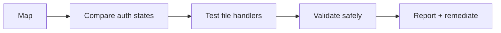

## Overview

Assessment of the CipherLab lab app covering both anonymous and logged-in states.
Every proof-of-concept was non-destructive and confined to the lab.

## Attack chain (lab only)

```mermaid
flowchart LR
  A[Map] --> B[Compare auth states]
  B --> C[Test file handlers]
  C --> D[Validate safely]
  D --> E[Report + remediate]
```
