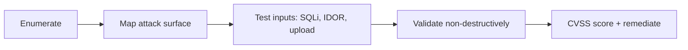

## Overview

Authorized black-box assessment of two intentionally vulnerable lab builds (PHP + Django) hosted locally.
The goal was a repeatable methodology: enumerate, test, validate without damage, rate with CVSS v3.1,
and write remediation a developer can act on.

## Attack chain (lab only)

No real targets, credentials, client data, or weaponized exploit code are included.
Full details live in the offline report; this page is a sanitized summary.
